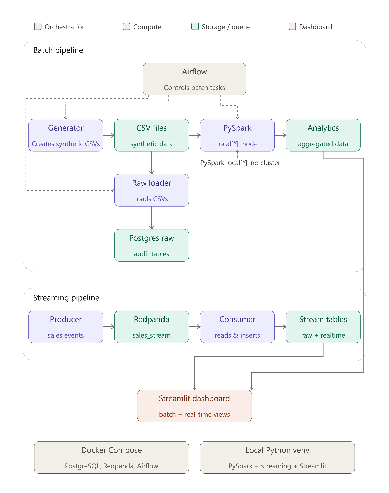
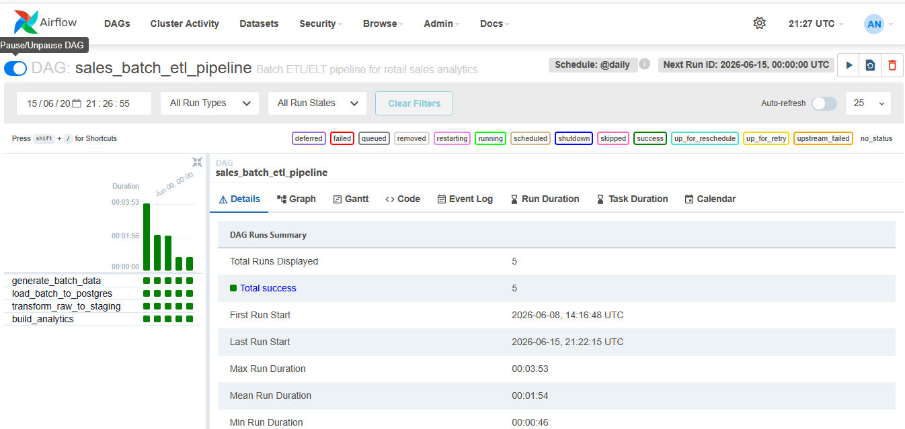
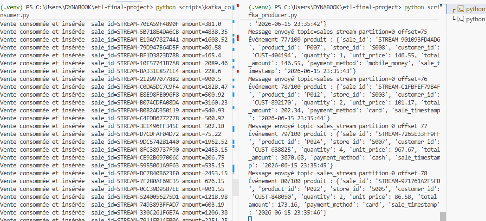
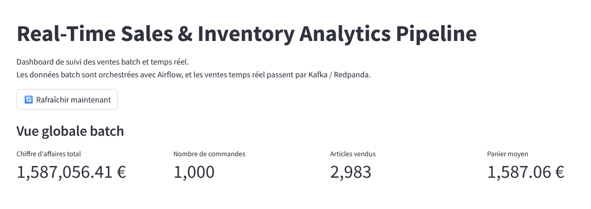
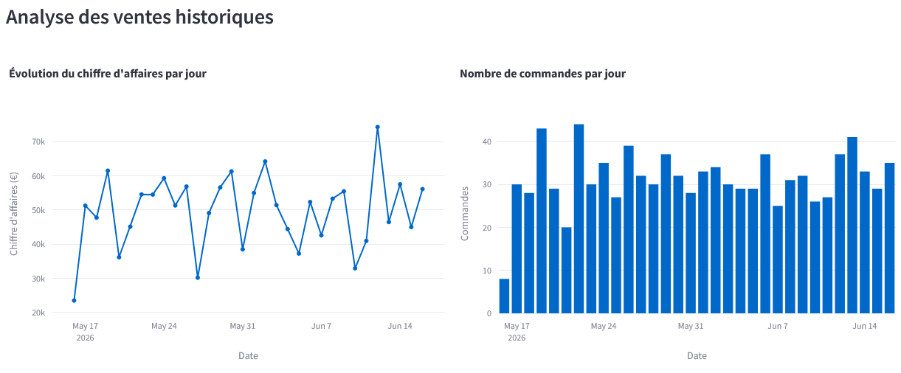
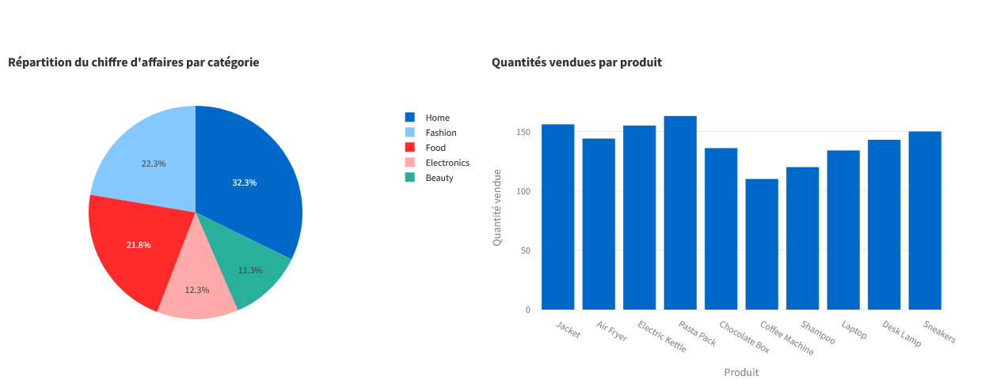
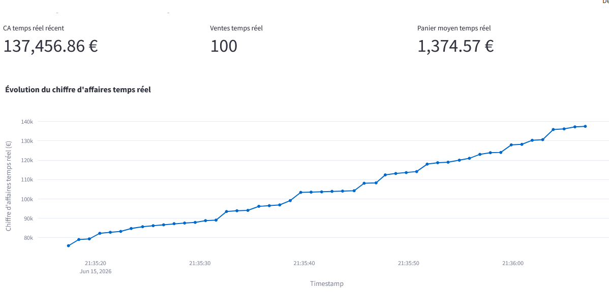
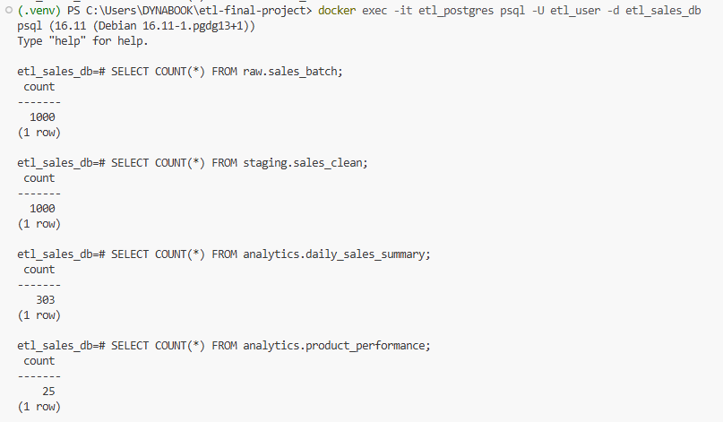
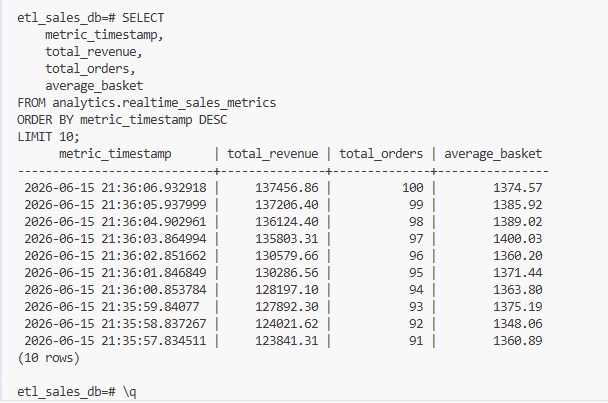

# Real-Time Sales & Inventory Analytics Pipeline

## Project Overview

This project is an end-to-end data pipeline for retail sales analytics.

It combines:

- Batch ETL
- PySpark transformations
- PostgreSQL data warehouse layers
- Airflow orchestration
- Kafka-compatible real-time streaming with Redpanda
- Streamlit dashboard

The objective is to transform raw sales data into useful business insights such as total revenue, number of orders, best-selling products, sales by city, and real-time sales metrics.

---

## Business Use Case

Retail companies generate sales data from multiple stores and channels.

However, raw data is not directly usable for analysis. It must be collected, cleaned, transformed, stored, and visualized.

This project simulates a retail company and answers questions such as:

- What is the total revenue?
- How many orders were made?
- Which products generate the most revenue?
- Which cities perform best?
- What are the real-time sales metrics?

---

## Data Source

The data used in this project is synthetic data generated with Python.

The script below generates realistic retail data:

```bash
python scripts/generate_batch_data.py
```

It creates three CSV files in `data/raw/`:

```txt
products.csv
stores.csv
sales_batch.csv
```

The dataset contains:

- 25 products
- 10 stores
- 1,000 historical sales records

This synthetic dataset is used as the input source for the batch ETL pipeline.

---

## Architecture

The project contains two main parts:

### 1. Batch Pipeline

The batch pipeline processes historical sales data.

```txt
CSV files
→ Python ETL
→ PostgreSQL raw tables
→ PySpark transformations
→ PostgreSQL staging and analytics tables
→ Streamlit dashboard
```

### 2. Streaming Pipeline

The streaming pipeline processes real-time sales events.

```txt
Kafka Producer
→ Redpanda topic
→ Kafka Consumer
→ PostgreSQL real-time tables
→ Streamlit dashboard
```

Architecture diagram:



---

## Technologies Used

| Category | Technology |
|---|---|
| Programming | Python |
| Batch Processing | PySpark |
| Database | PostgreSQL |
| Orchestration | Apache Airflow |
| Streaming | Redpanda / Kafka-compatible broker |
| Dashboard | Streamlit |
| Visualization | Plotly |
| Containers | Docker, Docker Compose |
| Data generation | Faker |
| Version control | Git, GitHub |

---

## Project Structure

```txt
etl-final-project/
│
├── dags/
│   └── sales_batch_pipeline_dag.py
│
├── dashboard/
│   └── app.py
│
├── data/
│   └── raw/
│       ├── products.csv
│       ├── stores.csv
│       └── sales_batch.csv
│
├── docs/
│   ├── architecture.png
│   ├── presentation.pdf
│   ├── capture_airflow_dag_success.png
│   ├── capture_dashboard_kpis.png
│   ├── capture_dashboard_historical_sales.png
│   ├── capture_dashboard_products_categories.png
│   ├── capture_dashboard_realtime_kafka.png
│   ├── capture_kafka_producer_consumer.png
│   ├── capture_postgres_batch_counts.png
│   └── capture_postgres_realtime_metrics.png
│
├── scripts/
│   ├── generate_batch_data.py
│   ├── load_batch_to_postgres.py
│   ├── run_batch_pipeline.py
│   ├── spark_transformations.py
│   ├── kafka_producer.py
│   ├── kafka_consumer.py
│   └── test_db_connection.py
│
├── sql/
│   ├── 01_create_tables.sql
│   ├── 02_staging_to_clean.sql
│   └── 03_build_analytics.sql
│
├── docker-compose.yml
├── requirements.txt
├── SETUP.md
└── README.md
```

---

## Database Design

The PostgreSQL database is organized into three schemas:

### Raw layer

The raw layer stores the original loaded data.

Main tables:

```txt
raw.products
raw.stores
raw.sales_batch
raw.sales_stream
```

### Staging layer

The staging layer stores cleaned and enriched sales data.

Main table:

```txt
staging.sales_clean
```

### Analytics layer

The analytics layer stores aggregated business metrics.

Main tables:

```txt
analytics.daily_sales_summary
analytics.product_performance
analytics.realtime_sales_metrics
```

---

## Batch ETL Pipeline

The batch pipeline starts by generating CSV files.

Then, the CSV files are loaded into PostgreSQL raw tables.

The main script is:

```bash
python scripts/run_batch_pipeline.py
```

This script runs:

```txt
1. scripts/generate_batch_data.py
2. scripts/load_batch_to_postgres.py
3. scripts/spark_transformations.py
```

At the end of the batch pipeline, the main tables are populated:

```txt
raw.products
raw.stores
raw.sales_batch
staging.sales_clean
analytics.daily_sales_summary
analytics.product_performance
```

---

## PySpark Transformations

The transformation layer is implemented with PySpark.

The Spark script is:

```bash
python scripts/spark_transformations.py
```

Spark performs the following operations:

- Reads the generated CSV files
- Joins sales data with products and stores
- Adds date and hour fields
- Cleans and enriches the sales dataset
- Computes daily sales metrics
- Computes product performance metrics
- Loads the transformed data into PostgreSQL

The transformed data is loaded into:

```txt
staging.sales_clean
analytics.daily_sales_summary
analytics.product_performance
```

This satisfies the Spark-based transformation requirement of the project.

---

## Airflow Orchestration

Apache Airflow is used to orchestrate the batch workflow.

The DAG file is:

```txt
dags/sales_batch_pipeline_dag.py
```

The DAG is called:

```txt
sales_batch_etl_pipeline
```

It contains the following tasks:

```txt
generate_batch_data
load_batch_to_postgres
transform_raw_to_staging
build_analytics
```

The DAG includes:

- Task dependencies
- Retry configuration
- Daily schedule
- Execution monitoring through the Airflow UI

Airflow UI:

```txt
http://localhost:8080
```

Default credentials:

```txt
username: admin
password: admin
```

Airflow success screenshot:



---

## Real-Time Streaming Pipeline

The streaming part simulates live sales events.

It uses:

- A Kafka producer
- Redpanda as a Kafka-compatible broker
- A Kafka consumer
- PostgreSQL for storage and metrics
- Streamlit for visualization

Streaming flow:

```txt
kafka_producer.py
→ Redpanda topic sales_stream
→ kafka_consumer.py
→ raw.sales_stream
→ analytics.realtime_sales_metrics
→ Streamlit dashboard
```

Producer script:

```bash
python scripts/kafka_producer.py
```

Consumer script:

```bash
python scripts/kafka_consumer.py
```

Kafka demo screenshot:



---

## Dashboard

The dashboard is built with Streamlit and Plotly.

It displays both historical batch analytics and real-time streaming metrics.

Run the dashboard with:

```bash
streamlit run dashboard/app.py
```

Dashboard URL:

```txt
http://localhost:8501
```

Main dashboard visualizations:

- Total revenue
- Number of orders
- Total items sold
- Average basket
- Revenue by day
- Orders by day
- Revenue by city
- Top products by revenue
- Revenue by category
- Real-time Kafka metrics
- Latest streaming sales

Dashboard screenshots:









---

## How to Run the Project

See the complete setup guide:

```txt
SETUP.md
```

Quick start:

```bash
cd C:\Users\DYNABOOK\etl-final-project
.\.venv\Scripts\Activate.ps1
docker compose up -d
python scripts/run_batch_pipeline.py
streamlit run dashboard/app.py
```

For streaming, open two terminals.

Terminal 1:

```bash
python scripts/kafka_consumer.py
```

Terminal 2:

```bash
python scripts/kafka_producer.py
```

---

## Validation Results

Batch validation:

```txt
raw.products: 25
raw.stores: 10
raw.sales_batch: 1000
staging.sales_clean: 1000
analytics.daily_sales_summary: around 300 rows
analytics.product_performance: 25
```

PostgreSQL validation screenshot:



Real-time validation screenshot:



---

## Key Results

The project successfully demonstrates:

- Synthetic retail data generation
- Batch ETL pipeline
- PySpark transformation layer
- PostgreSQL raw, staging and analytics layers
- Airflow orchestration
- Kafka-compatible streaming with Redpanda
- Real-time metrics processing
- Streamlit business dashboard
- Dockerized local environment

---

## Future Improvements

Possible improvements:

- Add dbt for SQL model management
- Deploy the project on the cloud
- Add Spark Structured Streaming
- Add data quality checks
- Add anomaly detection
- Add sales forecasting
- Add monitoring alerts

---

## Conclusion

This project demonstrates a complete modern data pipeline.

It processes historical sales data with batch ETL and PySpark transformations, handles real-time sales events with Kafka-compatible streaming, stores the results in PostgreSQL, and displays business insights in a Streamlit dashboard.

The pipeline provides both historical analytics and real-time monitoring for a retail business use case.